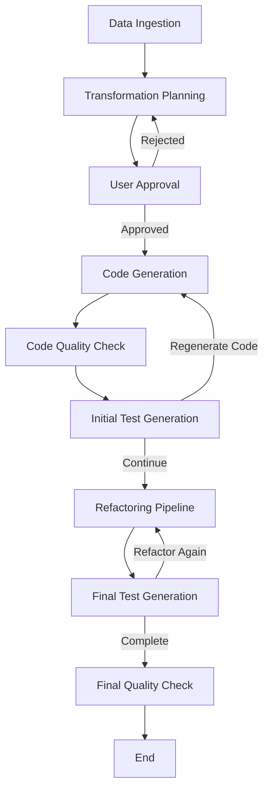

# 🚀 Pandas Pipeline Agent Flow Generator

[](https://www.python.org/downloads/)
[](https://opensource.org/licenses/MIT)
[](https://github.com/yourusername/pandas-pipeline-agent-flow-generator)

An intelligent, automated system for generating and testing pandas data cleaning pipelines using AI agents and structured quality checklists.

## 📋 Table of Contents

- [Overview](#-overview)
- [Architecture](#️-architecture)
- [Key Features](#-key-features)
- [Quick Start](#-quick-start)
- [Usage Examples](#-usage-examples)
- [Configuration](#-configuration)
- [Troubleshooting](#-troubleshooting)
- [Contributing](#-contributing)

## 📋 Overview

This project automatically creates, validates, and tests pandas data cleaning pipelines based on:
- **Data Quality Checklists**: Structured quality assessment criteria
- **User Instructions**: Custom cleaning requirements
- **Interactive Preferences**: Personalized data handling strategies
- **File Analysis**: Automatic detection of data patterns and issues

The system uses a multi-agent architecture powered by LangGraph and Groq LLM to generate production-ready pandas code with comprehensive error handling and documentation.

## 🏗️ Architecture

### Core Components

```
src/
├── agents/                    # AI Agent Modules
│   ├── data_ingestion_agent.py      # Analyzes input data structure
│   ├── transformation_planner_agent.py  # Creates cleaning strategies
│   ├── approval_agent.py            # User approval workflow
│   ├── code_generation_agent.py     # Generates executable pandas code
│   ├── code_quality_agent.py        # Code quality assessment
│   ├── refactoring_pipeline_agent.py # Code refactoring and optimization
│   └── test_agent.py               # Tests generated pipelines
├── core/                     # Core System Components
│   ├── data_schema.py              # Data models and schemas
│   ├── llm_config.py              # LLM configuration
│   └── tavily_utils.py            # Search utilities
├── utils/                    # Utility Systems
│   ├── data_quality_checklist.py   # Quality assessment framework
│   ├── interactive_data_patterns.py # User preference collection
│   ├── hybrid_rag_system.py        # Documentation search system
│   └── advanced_rag_system.py      # Enhanced search capabilities
└── pipelines/               # Pipeline Definitions
    └── main_pipeline_graph.py     # Main workflow graph
```

### Agent Flow



## 🎯 Key Features

### 🤖 Multi-Agent System
- **Data Ingestion Agent**: Analyzes file structure, data types, and quality issues
- **Transformation Planner**: Creates comprehensive cleaning strategies
- **Approval Agent**: Manages user feedback and plan refinement
- **Code Generation Agent**: Produces executable pandas pipelines
- **Code Quality Agent**: Assesses and improves code quality
- **Refactoring Pipeline Agent**: Optimizes and refactors generated code
- **Test Agent**: Validates generated code and data quality

### 📊 Data Quality Framework
- **8 Quality Categories**: Structure, naming, data types, missing values, text formatting, numeric values, duplicates, business rules
- **Priority-based Filtering**: Focus on high/medium/low priority issues
- **Interactive Preferences**: Personalized data handling strategies
- **Brazilian Data Support**: Specialized handling for Brazilian formats (comma decimals, DD/MM/YYYY dates, R$ currency)

### 🔍 Intelligent Search System
- **Hybrid RAG**: Combines sparse and dense search for documentation
- **Pandas-Specific Queries**: Optimized search for pandas operations
- **Multiple Strategies**: Documentation, code examples, best practices, troubleshooting

### 🛠️ Code Generation
- **Production-Ready Code**: Error handling, logging, and documentation
- **Brazilian Format Support**: Automatic handling of local data formats
- **Modular Templates**: Reusable code templates for common operations
- **Progress Tracking**: Detailed execution feedback

## 🚀 Quick Start

### Prerequisites

```bash
# Python 3.9+ required
python --version

# Install uv package manager (recommended)
curl -LsSf https://astral.sh/uv/install.sh | sh

# Or use pip
pip install -r requirements.txt
```

### Environment Setup

1. **Get Groq API Key**:
   - Visit [Groq Console](https://console.groq.com/)
   - Create a free account and get your API key

2. **Clone and Setup**:
   ```bash
   git clone https://github.com/yourusername/pandas-pipeline-agent-flow-generator.git
   cd pandas-pipeline-agent-flow-generator
   ```

3. **Configure Environment**:
   ```bash
   cp .env.example .env
   # Edit .env and add your GROQ_API_KEY
   ```

4. **Install Dependencies**:
   ```bash
   # Using uv (recommended)
   uv sync
   
   # Or using pip
   pip install -e .
   ```

5. **Verify Installation**:
   ```bash
   python -c "import pandas; import langgraph; print('✅ Dependencies installed successfully!')"
   ```

### Quick Demo

```bash
# Run the system with sample data
python main.py

# This will process the sample CSV file and generate a cleaning pipeline
```

## 📖 Usage Examples

### Basic Usage

```python
from main import run_agent_flow

# Simple usage with automatic quality assessment
run_agent_flow(
    file_path="data/input_samples/your_data.csv",
    user_instructions="Clean and standardize this dataset for analysis"
)

# Advanced usage with specific focus areas
from src.utils.data_quality_checklist import DataQualityCategory

run_agent_flow(
    file_path="data/input_samples/your_data.csv",
    user_instructions="Focus on data quality and standardization",
    focus_categories=[
        DataQualityCategory.MISSING_VALUES,
        DataQualityCategory.DATA_TYPES,
        DataQualityCategory.NAMING
    ],
    min_priority="high",
    use_checklist=True,
    interactive_preferences=True
)
```

### Available Functions

```python
# Run with basic checklist and testing
run_with_basic_checklist_and_testing()

# Run with focused checklist and testing
run_with_focused_checklist_and_testing()

# Run without checklist but with testing
run_without_checklist_but_with_testing()
```

## 📋 Data Quality Categories

### 1. Structure
- Dataset dimensions and format analysis
- Identification of unnecessary columns
- Data structure optimization

### 2. Naming
- Column naming conventions (snake_case, camelCase)
- Special character handling
- Brazilian Portuguese support

### 3. Data Types
- Type inference and optimization
- Date format standardization
- Categorical data handling

### 4. Missing Values
- Null value detection and strategies
- Imputation methods (mean, median, mode, custom)
- Row/column removal decisions

### 5. Text Formatting
- Case standardization (lower, upper, title)
- Whitespace normalization
- Special character handling

### 6. Numeric Values
- Decimal separator handling (Brazilian comma format)
- Currency symbol removal
- Outlier detection and handling

### 7. Duplicates
- Duplicate row identification
- Duplicate column detection
- Removal strategies

### 8. Business Rules
- Domain-specific validation
- Data consistency checks
- Business logic enforcement

## 🔧 Configuration

### LLM Configuration

```python
# src/core/llm_config.py
from groq import Groq

def get_llm(model_name: str = "llama3-8b-8192", temperature: float = 0.1):
    """
    Configure LLM with specific model and parameters
    """
    client = Groq(api_key=os.getenv("GROQ_API_KEY"))
    return client.chat.completions
```

### Quality Checklist Configuration

```python
# Customize quality assessment priorities
focus_categories = [
    DataQualityCategory.MISSING_VALUES,  # High priority
    DataQualityCategory.DATA_TYPES,      # High priority
    DataQualityCategory.NAMING,          # Medium priority
]

min_priority = "medium"  # Filter by priority level
```

## 📁 Project Structure

```
pandas-pipeline-agent-flow-generator/
├── src/
│   ├── agents/              # AI Agent implementations
│   │   ├── data_ingestion_agent.py
│   │   ├── transformation_planner_agent.py
│   │   ├── approval_agent.py
│   │   ├── code_generation_agent.py
│   │   ├── code_quality_agent.py
│   │   ├── refactoring_pipeline_agent.py
│   │   └── test_agent.py
│   ├── core/               # Core system components
│   │   ├── data_schema.py
│   │   ├── llm_config.py
│   │   └── tavily_utils.py
│   ├── utils/              # Utility systems
│   │   ├── data_quality_checklist.py
│   │   ├── interactive_data_patterns.py
│   │   ├── hybrid_rag_system.py
│   │   └── advanced_rag_system.py
│   └── pipelines/          # Pipeline definitions
│       └── main_pipeline_graph.py
├── data/
│   ├── input_samples/      # Sample input files
│   ├── output_parquet/     # Generated output files
│   └── vector_db/          # Vector database for RAG
├── pipelines/              # Generated pipeline code
├── tests/                  # Test suite
├── config/                 # Configuration files
├── main.py                 # Main application entry point
├── pyproject.toml          # Project dependencies
└── README.md              # This file
```

## 🧪 Testing

### Run Tests

```bash
# Run all tests
pytest tests/

# Run specific test file
pytest tests/test_agents.py

# Run with coverage
pytest --cov=src tests/
```

### Test Generated Pipelines

```bash
# Generated pipelines are saved in pipelines/generated/
python pipelines/generated/pipeline_your_data_latest.py
```

## 📊 Example Output

### Generated Pipeline Structure

```python
#!/usr/bin/env python3
"""
Generated Pandas Data Cleaning Pipeline
Auto-generated from transformation plan
"""

import pandas as pd
import numpy as np
from pathlib import Path
import warnings
warnings.filterwarnings('ignore')

# Configuration
INPUT_FILE = "data/input_samples/your_data.csv"
OUTPUT_FILE = "data/output_parquet/cleaned_data.parquet"

def main():
    """Execute the complete data cleaning pipeline"""
    
    print("🚀 Starting Data Cleaning Pipeline")
    print("=" * 50)
    
    # Load data
    print(f"📂 Loading data from {INPUT_FILE}")
    try:
        df = pd.read_csv(INPUT_FILE)
        print(f"✅ Loaded {len(df):,} rows and {len(df.columns)} columns")
    except Exception as e:
        print(f"❌ Error loading data: {e}")
        return
    
    # Data transformations...
    # Standardize column names
    # Handle missing values
    # Convert data types
    # Remove duplicates
    
    # Save cleaned data
    print(f"💾 Saving cleaned data to {OUTPUT_FILE}")
    df.to_parquet(OUTPUT_FILE, index=False)
    print("✅ Pipeline completed successfully!")

if __name__ == "__main__":
    main()
```

## 🔍 Advanced Features

### Interactive Preferences

The system can collect user preferences for:
- Missing value strategies (fill with mean, median, custom value, drop rows)
- Date format preferences (DD/MM/YYYY, YYYY-MM-DD, auto-detect)
- Decimal separator handling (comma vs dot)
- Currency symbol removal
- Case standardization preferences

### Hybrid RAG System

- **Sparse Search**: Keyword-based search using TF-IDF/BM25
- **Dense Search**: Semantic search using embeddings
- **Query Expansion**: Intelligent query enhancement for better results
- **Multiple Sources**: Official documentation, community examples, best practices

### Brazilian Data Support

Specialized handling for Brazilian data formats:
- Comma decimal separators (1.234,56 → 1234.56)
- DD/MM/YYYY date formats
- Brazilian currency symbols (R$)
- Portuguese column names and data

## 🔧 Troubleshooting

### Common Issues

**1. Groq API Key Error**
```bash
# Make sure your .env file contains:
GROQ_API_KEY=your_actual_api_key_here
```

**2. Import Errors**
```bash
# Ensure you're in the project directory and dependencies are installed
cd pandas-pipeline-agent-flow-generator
uv sync
```

**3. File Path Issues**
```bash
# Make sure your data files exist in the correct location
ls data/input_samples/
```

**4. Memory Issues with Large Files**
```python
# For large datasets, consider chunking or sampling
df_sample = df.sample(n=10000)  # Process a sample first
```

### Performance Tips

- Use `uv` instead of `pip` for faster dependency management
- For large files (>1GB), consider using `dask` or chunking
- Enable logging for debugging: `export LOG_LEVEL=DEBUG`

## 🤝 Contributing

1. Fork the repository
2. Create a feature branch (`git checkout -b feature/amazing-feature`)
3. Commit your changes (`git commit -m 'Add amazing feature'`)
4. Push to the branch (`git push origin feature/amazing-feature`)
5. Open a Pull Request

## 📝 License

This project is licensed under the MIT License - see the [LICENSE](LICENSE) file for details.

## 🙏 Acknowledgments

- **LangGraph**: For the agent workflow framework
- **Groq**: For fast and reliable LLM inference
- **Pandas**: For the powerful data manipulation library
- **Tavily**: For intelligent search capabilities

## 📞 Support

For questions, issues, or contributions:
- Open an issue on GitHub
- Check the documentation in the `docs/` folder
- Review example usage in the `examples/` folder

---

**Made with ❤️ for automated data pipeline generation**
